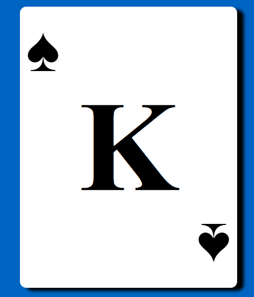
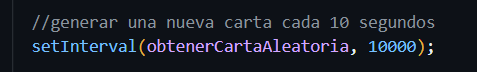
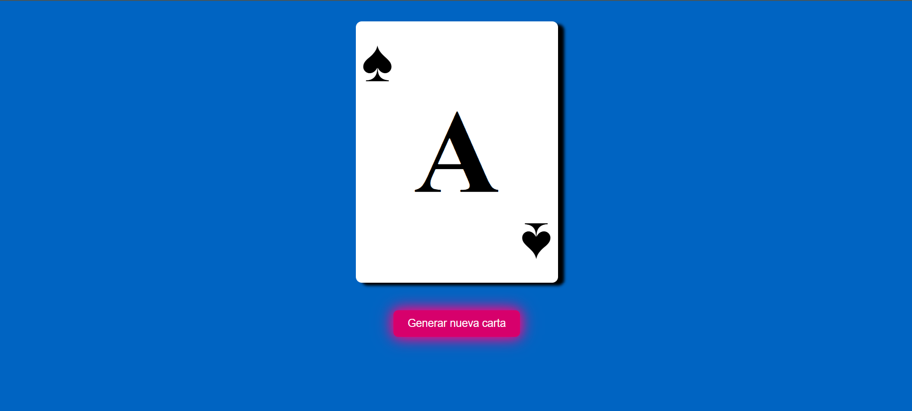
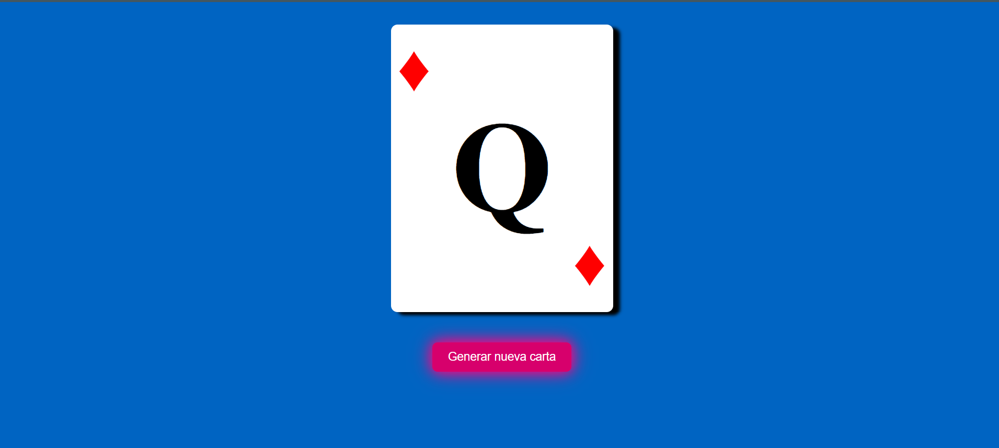
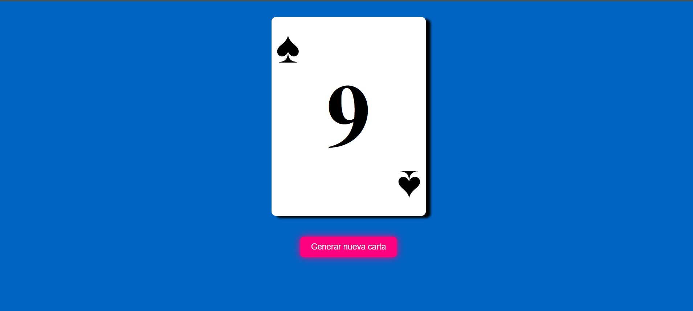

# Generador de Cartas Aleatorias

Este proyecto genera una carta aleatoria cada 10 segundos automáticamente, o cuando el usuario presiona el botón correspondiente.

## Capturas de Pantalla

### Carta Aleatoria Generada


### Cambio Automático de Carta


### Botón para Generar Nueva Carta


### Otras Capturas
Incluimos aquí más ejemplos visuales del proyecto:





Autor
Creado por Aaron Cuadrado Toral.
Si tienes preguntas, ¡no dudes en contactarme!


## Tecnologías Utilizadas

- **HTML**: Para estructurar el contenido de la página.
- **CSS**: Para estilizar la aplicación con colores vivos y botones interactivos.
- **JavaScript**: Para la lógica de cambio de carta automática y manual.

## Características

- Cambio automático de carta cada 10 segundos.
- Posibilidad de cambiar la carta manualmente al presionar el botón.
- Interfaz simple y colorida.

## Cómo Ejecutarlo

1. Clona este repositorio en tu máquina local:
   ```bash
   git clone https://github.com/AaronCuadrado/RandomCard.git

## Autor

**Aaron Cuadrado Toral**  
Desarrollador apasionado por la creación de proyectos interactivos y educativos.  
Si tienes preguntas o sugerencias, ¡no dudes en contactarme!  

- **GitHub**: [Tu perfil de GitHub](https://github.com/AaronCuadrado)  
- **LinkedIn**: [Tu perfil de LinkedIn](https://www.linkedin.com/in/aaroncuadrado)  
